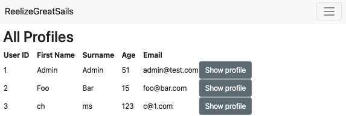

# R9 - A link (URL) to your deployed app (i.e. website)
[Link to my deployed website](https://sleepy-castle-19697.herokuapp.com/reels)

# R10 - A link to your GitHub repository (repo).
[Link to my repo here](https://github.com/storm0105/ReelizeGreatSails)

# R7 - Identification of the problem you are trying to solve by building this particular marketplace app.

Through the app I created, ReelizeGreatSails, I am tackling the problem of there not being a credible store for 2nd hand fishing reels. Many enthusiasts, myself included, have a large range of fishing reels and we enjoy upgrading our reels, however once we get a better reel, there is no place for the old reel except as a back-up. By developing my app ReelizeGreatSails, I am creating a place for users to sell their reels that they don’t use anymore and to buy other reels for a cheap price. Having a look online, there are nearly no online marketplaces for people to list their fishing reels except for places such as Gumtree or Facebook marketplace.

I have also conducted market research by looking for online marketplaces that specifically buy and sell fishing reels however was not able to find any. I have also asked around in forums if other enthusiasts would appreciate a marketplace that is designated to second hand reels and I got a positive response back that they would appreciate my idea. One of the main reasons they want a marketplace for second hand reels is that they would like to purchase other gears for cheap as back up, or to part out and a large reason is that they are running out of room due to having too much fishing gear, however are reluctant to sell it too cheap as they get lowball offers on other marketplaces such as gumtree and facebook marketplace or since the reels have sentimental value, they wish to sell it to someone that would take care of their gear. I wish to create a marketplace to solely focus on this niche market.

# R8 -  Why is it a problem that needs solving?

It is a problem that needs solving as a lot of people have high-end reels that they don’t use anymore as they have now upgraded to an even better reel. Personally, I buy at least one new reel every year and now I have quite a lot at home. If I had a marketplace where I could list my old reels, I would be able to free up a lot of room at home. Also, quality fishing reels are not cheap and can easily go over $1000 each, however most people don’t buy such expensive gear straight away. They slowly work themselves up, from a cheap reel, to slightly more expensive and keep upgrading. By the time they get their dream fishing reel, they may have 3 other reels of the same size that are taking up too much room and they are unwilling to throw away as they have spent decent money on it. My group of friends have many reels that they are unable to sell, as people in Gumtree and Facebook Marketplace usually don’t have a good eye for quality and offer prices that are too low.

ReelizeGreatSails is an app that was designed specifically for fishing enthusiasts, so they will most likely know the real value of the fishing reels and the specs. With this app, people will be able to buy quality fishing reels for a much lower price as they are second hand, and through images uploaded, users will be able to see the item condition and whether it is a good purchase. Also as Australia is a country geographically surrounded by water, many people enjoy water sports and fishing. Especially during lockdown when people were not able to go overseas, sales of fishing equipment soared and popular fishing spots around the harbour were packed with people. By creating this app, I would be able to not only help people purchase fishing gear for cheap, the people that lost interest in fishing after lockdowns have ended would have a place to sell their reels.

# R11 - Description of your marketplace app (website), including:
- Functionality / features
- Sitemap
- Screenshots
- Target audience
- Tech stack (e.g. html, css, deployment platform, etc)

## Functionality 
ReelizeGreatSails is a two sided marketplace where users can both buy and sell fishing reels. As a two sided marketplace, users can sell their reels, hence I created a sell button on the main catalogue. After submitting the necessary form for selling a reel, it will appear on the catalogue. Each item on the catalogue is in the form of a card, which has a picture of the item(if applicable) and also some quick details about it. There is a `More info` button on each card that once clicked on, directs you to another page to view more information about the reel. It also has a `Buy now` button inside which redirects you to the Stripe API in order to provide payment details to purchase the item. If you do not wish to purchase the item after viewing the details, there is also a `Back to catalogue` button which redirects you to the catalogue.

The owner of the reel or the admin also has the option to edit the information provided about the reel or delete the reel inside the reel show page through the use of a `Edit` button and `Delete` button.. Other users will not have access to these features and will be redirected back to the catalogue if they try to force it. 

As for the profile page, the information you provided is listed there. There is also an `Edit Profile` button which allows you to change your name and age. Underneath the details provided, there is a `Listed Item` table that displays the items you have listed for sale.

For admins only, there is an `All Profile` section that they have access to. In this area, it lists all the details of every user that has an account and also has a link that allows them to view their profile.

I have also added a wish list that is session based, hence relies on cookies to operate meaning nothing is saved in the database. I was planning on creating a shopping cart to save interested reels in however decided on a session based wish list as if a person leaves an item in their cart for too long, it may already get sold. Hence, the session based wish list is a way to minimise calls to the database.

## Sitemap

## Screenshots
### Profile page

#### PC profile page

#### Tablet profile page

#### Mobile profile page

### Index page for reels. AKA catalogue

#### PC catalogue

#### Tablet catalogue

#### Mobile catalogue

### Individual listings for reels

#### PC individual listing

#### Tablet individual listing

#### Mobile individual listing

### Admin only profile index page

#### PC Admin only profile page

#### Tablet Admin only profile page

#### Mobile Admin only profile page

### Payment page

#### PC Payment

#### Tablet Payment

#### Mobile Payment

## Target audience
The target audience are people that enjoy fishing. There is no real age range for my target audience as kids can go fishing if they can hold a rod, and their parents would be willing to purchase reels for them, or sell the reels their children are using to upgrade and get better ones. For the more mature audience with income, they would be willing to sell their old reels in order to purchase better ones, which will keep the supply steady for buyers. I am also taking advantage of the geographical location of Australia, which is surrounded by water hence people tend to like water sports more than other countries that have limited access to the sea. 

## Tech stack
For this app, I used `HTML` paired with styling from `CSS` provided by Bootstrap for my views pages. It was also mixed with Ruby logic. The app also relies on `Heroku` for its deployment platform, which relies on `git`. ReelizeGreatSails used `Cloudinary` in order to upload images via its cloud. Another API that was used is `Stripe`, which handles the payment such as credit card information for purchased items by connecting to the Stripe server internally and Stripe also relies on a script from `JavaScript` to work.

The programming `Ruby` was also used in conjucture with `Ruby on Rails`, which is a server-side web application framework. In order to create the sitemap and wireframes, `Balsamiq Wireframes` were used.

# R12 - User stories for your app
My user stories were as followed:

- As a user I want to check my own profile so I know my details.
- As a user I want to be able to check each individual item so I know what I am buying or looking at in closer details.
- As a user I want to be able to list my own fishing reel so I can sell it.
- As a user I want to be able to view pictures of the items I am buying so I know the condition.
- As a user I want to be able to edit my profile in case I put down wrong information in registration.
- As a user I want to be able to log in so i can have secure purchases and browsing.
- As a user I want to be able to view all fishing reels so I can browse on one page.
- As a user I want a navbar so I can navigate between the sites easily.
- As a user I want to be able to purchase items safely over the internet so I have peace of mind.
- As a user i want to add fishing reels to a wish list so i know what I was looking at
- As a user i want to be able to remove fishing reels from my wish list in case I change my mind.
- As a user I want to be able to view my purchase history so I know what I previously bought.
- As a user I want to be able to view all my listings so I know what has not sold yet.

# R13 - Wireframes for your app

## Profile page

## Catalogue / Listing page

## Individual listing page

## Log in page

## Payment page

## Profile page

## Success page

# R14 - An ERD for your app & R19 - Provide your database schema design

# R15 - Explain the different high-level components (abstractions) in your app
How rails handle MVC is that it first gets a route. After it gets the HTTP request from the route, it goes to the controller. If the controller action requires the model, the control interacts with the model, which gets the information from the database and sends it back to the controller. The controller then receives the data from the model, which retrieved the data from the database, and performs actions on it before transmitting that information to the view, where the data is rendered out. The controller is in charge of handling decisions, the model is in charge of handling data and view handles presentation.

Inheritance is when one class inherits attributes of another class. This is done by stating `class Class1 < Class2`. This means that Class1 inherits the attributes, or methods of the superclass, being Class2. This is represented in Ruby on Rails and my application, as the models and controllers are classified as classes and they all have a superclass. The superclass is defined with the word Application before each component, such as ApplicationController, which all other controllers inherit attributes from.

An example of this in my app for Controllers is my private messages for error handling. The `forbidden`, `unauthorised_profile` and `unauthorised_reel` methods are all methods that display a message if certain conditions are met, such as if current user tries accessing a different persons profile, the `unauthorised_profile` method would activate. This is because the `ProfilesController`, which is a subclass, or child, of `ApplicationController`, which is its superclass, or parent. This means that the `ProfilesController` has access to the methods that were put into the `ApplicationController`. The reels controller would call on the `unauthorised_reel` method if a person tries to access something that they do not have access for in the reels controllers, even though the `unauthorised_reel` method is in the `ApplicationController`. This too is because the Reels controller is a subclass of the `ApplicationController`.

For the models, the superclass `ApplicationRecord` is the superclass for all other models I have created, such as `Brand`, `Profile`, `Purchase`, `ReelType`, `Reel`, `Role` and `User`. However, as the `ApplicationRecord` does not have any methods defined in it, there is nothing for the other subclasses to inherit.

For the views, there is no inheritance or superclass/subclass. This is because the views are just for renderring out the logic that was delivered from the controllers, hence it is a `html.erb` file. A html.erb file allows html and css to be applied, however it can also render out ruby logic or statements. This is done by using normal html syntax, however if we wish to use ruby logic, it has to be inbetween `<% %>`. If we need to render out html logic, it is done by putting it inbetween `<%= %>`. The views also has an application file called `application.html.erb`, however this is a style sheet that allows consistency between all pages, hence why I added in my navbar here, so it is accessible no matter what page you are on in my app.

As for the interactions between resources, not every resource has a view, and some do not have controllers. This is because they are not needed. For example, I have a Reels resource that has a view, controller and model. I needed two more models to further normalize my tables, being the models `Brand` and `ReelType`. These two do not require their own controller as they are a part of Reels and do not require any standalone logic to be applied to them. They also do not have their own view as it is not needed. They can share the same view as the Reels, and any logic that is to be applied to these two models can be applied in the `ReelsController`. This can be further seen by the method `set_brand_reel_type` in the `ReelsController`, which is used in order to either create or update a reel. Also, both these models have a `has_many` active record association with reels, hence we can access them through logic that is applied in te `ReelsController`.

Another example is the `ProfilesController`. The Profiles resource has routes, controllers and views, however we can also display other models in its views, such as `Reels`. This is also because the `Profile` model has an active record association `belongs_to :user`, and `User` has a `has_many` association with `Reels` and `has_one` association with `Profile`. From Profiles, we can backtrack the associations in order to get the reels that belong to the user which is connected to the profile model. An example is the `show` action for the `Profile` controller. The `show` is rendered in `show.html.erb` inside the Profiles folder, and to get the listed item we first call a method to get the user associated with the profile. Once we get the user associated with the profile, we can call on the reels model that is associated with the user model to get the listings that the user has put up for their fishing reels.

The `Purchases` model also does not need its own view or controller. As `Purchases` is a model that is to be used in conjunction with portfolios, as the portfolio #show action was used to render out the data in the `Purchase` model.

# R16 - Detail any third party services that your app will use
ReelizeGreatSails uses 3 third party services. A third party service is a service that someone else provides externally that can be used in an app. For instance, gems are not considered third party services as they are provided by other users, however they do not connect to outside of the app. In the case of the app I made, ReelizeGreatSails, the 3 third party services I used were Stripe, Cloudinary and Heroku.

Stripe - Stripe is a payment processor. To use Stripe as intended, we had to install the Stripe gem which is not the 3rd party service. However after installing the gem, Stripe internally connects to the Stripe server, which can be considered a 3rd party service. For Stripe to connect to the server, a new session is defined in the controller actions. For my app, I chose to display it in the `reels#show` controller action. Inside the `show` view page for `Reels` controller, more code had to be inserted for the gem to connect to the 3rd party service. A JavaScript script is inserted here which connects to the session that is defined in the controller action and to activate the script, a "Buy now" button was inserted which has links to the script once it is clicked on. In order for our app to have access to the stripe API, the Stripe API keys were submitted as an environment variable after downloading the gem `dotenv`. By doing it like this, if we push our repo to a version control system, the .env file will not be uploaded to the version control system as we have included it in the `.gitignore` file.

Heroku - Heroku is a 3rd party service, more specifcally a platform as a service (PaaS). This allows developers to operate applications that are uploaded to the Heroku cloud server. For this to be done, we had to install the Heroku CLI and then type `heroku login` to log into our Heroku account for use in the heroku CLI. It also requires Git, which is a version control system. We then have to create a Heroku remote, which are the repos for our apps that exist on other servers. In order for Heroku to have access to our database, we had to run `heroku run rails db:create`, `heroku run rails db:create` and to connect it to our seed file, `heroku run rails db:seed`. Once we have connected the heroku remote to our app, we have to push it. This command is `git push heroku main`. After pushing, our app is being deployed on the heroku server and will provide us with a URL so anyone can view our app.

Cloudinary - Cloudinary is a Software as a Service (SaaS) company, which is a company that delivers its services over the internet. In this case, cloudinary is a image-hosting site that provides image and video management solutions for websites and such. This is done as Cloudinary allows uers to upload, store, manage and manipulate images on its cloud server. To connect this to my app, i had to download two gems. One being Cloudinary and the other being activestorage-cloudinary-services. For Cloudinary to work, we had to provide the service, cloud name and api keys inside `storage.yml` and also change the active storage service to cloudinary for development and production. The api keys were provided inside the .env file, which was referenced to inside `storage.yml`. Just like Stripe, the .env file will not be uploaded to github hence the API keys will remain only with the local repository on my devise. Cloudinary has its own rail syntax, which is `cl_image_tag`, which then you provide more parameters, such as the model associated, the dimensions of the image you wish to render and the cloud name, which is set in the .env file.

# R17 - Describe your projects models in terms of the relationships (active record associations) they have with each other
## Brand
### `has_many: reels`
The `Brand` model has the association `has_many :reels`. A fishing reel can only be a single brand, however as there are more than 1 brand available, I created a model with a `has_many` association to `reels`.

## Profile
### `belongs_to :user`
The `Profile` model has the association `belongs_to :user`. This association is because each profile is to be linked with a user. As the primary key `user_id` of the User model is in the Profile model as a foreign key, we should use `belongs_to` rather has `has_one`. 

## ReelType
### `has_many :reels`
The `ReelType` model has the association `has_many :reels`. This is because `ReelType` has a one-to-many association with `Reel`. Each fishing reel can only belong to one type, however there are multiple types of fishing reels, such as an overhead reel or casting reel. Due to having more than one type of reel type, it has a `has_many` association.

## Reel
### `belongs_to :reel_type`
As the primary key for `ReelType` model is being used as a foreign key in the `Reel` model, the association `belongs_to` is being used. A fishing reel must have a reel type as that is one of the distinguishable features between reels.

### `belongs_to :brand`
The primary key for `Brand` model, being `brand_id` is being used as a foreign key in the `Reel` model. Because of this, the association `belongs_to` is used. Each fishing reel must have a brand as that is also one of it's distinguishable features between reels.

### `belongs_to :user`
The association `belongs_to` is being used to associate it with the `User` model. This is because if a person is listing a fishing reel online, it must first belong to someone as it is a second hand market and not a retailer store. Due to this, the primary key for the `User` model is being used as a foreign key in the `Reel` model.

### `has_many :purchases`
The association `has_many` is used to associate the `Reel` model with the `Purchase` model. This is due to multiple purchases could be made, hence it makes sense for the association to be plural, not singular.

## Role
### `has_and_belongs_to_many`
The `Role` model has the association `has_and_belongs_to_many`. This association is because a user can have one role, or many roles. Not only that, a role could also have only one user or many users. This is used in conjunction with the `User` model in order to create the `:user_roles` join table. In the join table, each `user_id` can be paired with each corresponding role it has.

## User
### `has_many :purchases`
The `User` model has the association `has_many` with the `Purchase` model. This is because each individual user could buy 0 item, 1 item or multiple items. Due to having the option to buy multiple items, it makes sense for the association to be `has_many`.

### `has_one :profile`
As the primary key `User_ID` is being used as a foreign key in the `Profile` model, it is a `has_one` association.

### `has_many :reels`
The `User` model has a `has_many` association with `Reel` model. This is because a `User` can have multiple reels or have none. As the user can be a buyer or seller, they may list up multiple reels, a single reel or none and is just looking to purchase a few.

## Purchase
### `belongs_to :user`
As the primary key `user_id` is used inside the Purchase model, it has an association with the `User` model. As a purchase has to belong to a user, it is associated to it that it `belongs_to` a user. 

### `belongs_to :reel`
As a purchase has to have a reel, and the purchase model also has the primary key of the `Reel` model, being `reel_id` inside it, it is associated as a purchase `belongs_to` a reel. A purchase cannot happen without a reel.

# R18 - Discuss the database relations to be implemented in your application
Each model in ReelizeGreatSails is represented as an entity in the entity relationship diagram (ERD). The ERD shows how the entities relate to each other, and if two entities have an association, that is called a relationship. 

## User
The `User` entity has a one-to-many relationship with the `Reel` entity. This is because one User may have multiple reels, whilst a reel has only one user as it must have an owner that listed the product on ReelizeGreatSails. In terms of cardinality, one user can have 0 reels, as they are a buyer and not selling any reels or could be 1 to multiple reels.

The `User` entity has a one-to-one relationship with the `Profile` entity. When signing up a new user in ReelizeGreatSails, the user must provide their profile details in order to sign up, hence why it is a one-to-one relationship. If we are to take in cardinality in the ERD, the upper and lower limit for both `User` and `Profile` are one, hence one user must have one profile, no more no less.

The `User` entity has a one-to-many relationship with the `User_roles` entity. This is because each user can have multiple roles and a role can have multiple users. This means `User` and `Roles` entities have a many-to-many relationship, however as that cant be expressed directly in Ruby on Rails, we use a join table, hence create the `User role` entity. In order to make a join table, both entities must have a one-to-many relationship with the new entity created between them, essentially creating a many-to-many relationship.

The `User` entity has a one-to-many relationship with the `Purchase` entity. As a user could have multiple purchases, it makes sense for the `User` entity to have a relationship that is plural, rather than singular. In terms of cardinality, a user may create an account and just be browsing, hence it could have 0 purchases. The user could also purchase multiple reels, hence it is a 0 to many cardinality.

## Brand
The `Brand` entity has a one-to-many relationship with the `Reel` entity. Each reel has to have a brand, whilst there can be multiple brands available to choose from. The ERD shows the cardinality being each brand could have 0 or many reels. This is because it can be 0 if there are no fishing reels listed, to there being multiple brands available to choose from.

## Reel type
The `Reel type` entity has a one-to-many relationship with the `Reel` entity. We can explain the cardinality in this relationship as each reel type could have 0 or many reels, as it can be 0 if there are no reels to be listed. It can also be 1 or many depending on how many reel types have been listed. For the case of simplicity, I only added two reel types to my app, which are the two main reel types that people usually buy.

## Profile
The `Profile` entity has a one-to-one relationship with the `User` entity. Each profile must have a user due to the registration process relying on validation that the profile information is present when signing up. As explained above, as each profile must have a user and vice versa, it is a mandatory one-to-one relationship, meaning if there is no profile, there is no user.

## Role
`Role` entity has a one-to-many relationship with the `User` entity. It also has an indirect many-to-many relationship with the User entity through the use of the join tables `User_roles`. In terms of cardinality with the relationship it has with the `User roles` entity, each `user_role` record must have a roles, whilst a role may have 0 user roles assigned, or have multiple hence why it is a one-to-many relationship.

## User Role
The `User role` entity has a many-to-one relationship with the `User` entity. As each user role must have a user, it can be described as a many-to-one. The cardinality of this relationship is that each user role must have one and only one user assigned to it, whilst each user may or may not have a user role assigned to it.

It also has a many-to-one relationship with the `Role` entity as each user role has a role, however each role may or may not have a user role assigned to it.

## Reel
The `Reel` entity has a many-to-one relationship with the `Reel type` entity. This is because each reel must have a reel type classification, whilst there can be many reel types to choose from. In terms of cardinality, as each fishing reel must have a reel type, it is a one-and-only-one in terms of `Reel` entity towards the `Reel type` entity. 

`Reel` entity also has a many-to-one relationship with the `Brand` entity. This is because a fishing reel must have a brand, however there are multiple brands. As each fishing reel must have a brand, it is strictly one-and-only-one per reel, whilst a brand could have 0 or many fishing reels available.

It also has a many-to-one relationship with the `User` entity. As each reel must have a user who listed it on the app, whilst each user could list 0 or many reels on the app. The cardinality that the `Reel` entity has towards the `User` entity is that it is one-and-only-one, meaning there must be one user listed for each reel.

The `Reel` entity also has a one-to-one relationship with the `Active storage` entity. As a user of the reel may not wish to upload a picture of the reel, it has a 0 or one cardinality. 

The `Reel` entity has a one-to-many relationship with the `Purchase` entity. As a reel could be also not be purchased, or purchased multiple times, it makes sense for the cardinality to be 0 to many.

## Active Storage
The `Active storage` entity has a one-to-one relationship with the `Reel` entity. In terms of cardinality, as each image in the active storage entity belongs to a reel, it is a one-and-only-one.

## Purchase
The `Purchase` entity has a many-to-one relationship with both the `Reel` entity and the `User` entity. This is because a single User could purchase multiple reels, hence have multiple purchases, whereas multiple reels could be sold, hence also multiple purchases. The `Purchase` entity has the cardinality of it must have a reel and must have a user, hence being one and only one relationship to both these entities.

# R20	- Describe the way tasks are allocated and tracked in your project
Tasks were allocated and tracked in my project through the use of a Kanban board on Trello. First, I created User stories of what features I wanted in my app. After creating user stories, I focused on what steps were needed to achieve the implementation of that feature. After the steps were listed, I created an ERD to help picture how my apps models would interact with each other and what was needed.

After the ERD, the wireframes and sitemap was next to understand what controllers were needed and which views to create. Also, it helped me choose which routes to use resources for. Once all the planning was finished, I moved the cards in my trello board from `Backlog` to `to do`. While I was going through the steps in the card in the `to do` column, I would move it to the `In progress` column as I was now implementing the feature. After the feature was implemented, I would move it to the completed column and mark it green to show its complete.

The yellow highlights were to indicate that the card was an optional feature and not being assessed on. The orange highlights were to indicate that it is a component being assessed, however not the most important to implement. However, the red highlights indicate that they were very important to my plan in creating the app and were also components being assessed.

Please see Trello board screenshot below.
****

To view my Trello board, please click [here](https://trello.com/b/GbxIHRig/t2a2)